# Updated Pipeline Workflow (2026-06-18)

This is the validated 6-phase workflow from the actual pipeline run against 3 N5 vocabulary videos (233 total flashcards generated).

```mermaid
flowchart TD
    %% ── STYLING ──
    classDef start fill:#4CAF50,stroke:#2E7D32,color:#fff,stroke-width:2px
    classDef tool fill:#2196F3,stroke:#1565C0,color:#fff,stroke-width:2px
    classDef decision fill:#FF9800,stroke:#E65100,color:#fff,stroke-width:2px
    classDef error fill:#F44336,stroke:#B71C1C,color:#fff,stroke-width:2px
    classDef output fill:#9C27B0,stroke:#6A1B9A,color:#fff,stroke-width:2px
    classDef script fill:#795548,stroke:#4E342E,color:#fff,stroke-width:2px
    classDef ui fill:#00BCD4,stroke:#00838F,color:#fff,stroke-width:2px

    %% ── START ──
    START(["`🚀 **Start**
    User provides YouTube URL
    for N5 vocabulary video`"]):::start

    %% ── PHASE 1: DOWNLOAD ──
    subgraph P1["`**PHASE 1 — Subtitle Download**`"]
        direction TB
        SEARCH["`🔍 **yt-dlp search**
        ytsearch5:N5 vocabulary
        → video IDs, views, durations`"]:::tool
        PICK["`🎯 **Pick top 3 videos**
        By view count & relevance
        e.g. 2.75M, 302K, 151K`"]:::start
        YTJA["`⬇️ **./yt-ja URL**
        yt-dlp --write-auto-subs
        --sub-langs ja --skip-download
        → {title}[{id}].ja.srt`"]:::tool
        RETRY{Download<br/>success?}:::decision
        ERR_429["`⚠️ HTTP 429
        Rate limited.
        Retry with delay`"]:::error
        ERR_NOSUB["`❌ No ja subtitles
        Skip this video`"]:::error
        SRT["`📄 **.ja.srt file**
        Auto-generated Japanese
        subtitles with timestamps`"]:::output
    end

    %% ── PHASE 2: PARSE ──
    subgraph P2["`**PHASE 2 — Transcript Parsing**`"]
        direction TB
        PARSE["`🐍 **parse_srt.py**
        Regex: HH:MM:SS → seconds
        → TranscriptBundle JSON`"]:::script
        TRANSCRIPT["`📋 **TranscriptBundle**
        video meta + segments[{text,
        start_time, end_time, index}]`"]:::output
        COMPRESS["`🐍 **compress_transcript.py**
        Deduplicate repeated text
        Preserve all timestamps`"]:::script
        CHECK_CJK{Contains CJK<br/>characters?}:::decision
        ERR_NOJP["`❌ No Japanese captions
        No hiragana/katakana/kanji`"]:::error
    end

    %% ── PHASE 3: EXTRACT ──
    subgraph P3["`**PHASE 3 — Candidate Extraction**`"]
        direction TB
        EXTRACT["`🐍 **extract_candidates.py**
        Extract Japanese tokens
        Filter particles/single kana
        Count frequency
        Top 250 candidates`"]:::script
        CANDIDATES["`📊 **Candidates JSON**
        {video, stats, candidates:
        [{word, count, contexts}]}`"]:::output
    end

    %% ── PHASE 4: VOCABULARY ──
    subgraph P4["`**PHASE 4 — JLPT Classification (Agent)**`"]
        direction TB
        AGENT["`🤖 **Launch Agent**
        Input: candidates list
        Task: classify N5/N4/N3
        + reading + meaning + POS`"]:::tool
        CLASSIFY{Parse<br/>success?}:::decision
        RETRY_AGENT["`🔄 **Retry agent**
        Same input + explicit
        schema reminder`"]:::tool
        ERR_AGENT["`❌ Surface error
        Try different video`"]:::error
        EMPTY{Vocab<br/>non-empty?}:::decision
        ERR_EMPTY["`⚠️ No JLPT N5–N3
        vocabulary found`"]:::error
        VOCAB["`📚 **VocabularyList JSON**
        [{word, reading, meaning,
        pos, jlpt_level, count}]`"]:::output
    end

    %% ── PHASE 5: FLASHCARDS ──
    subgraph P5["`**PHASE 5 — Flashcard Generation**`"]
        direction TB
        MAP["`🐍 **generate_flashcards.py**
        card-001→card-NNN IDs
        Match word→transcript timestamps
        Build YouTube deep links (&t=Ns)
        Primary link: first occurrence
        Secondary links: extra occurrences
        Context snippet (max 200 chars)`"]:::script
        META["`**Generate meta**
        video_id · video_title · url
        generated_at · total_cards
        jlpt_breakdown: {N5, N4, N3}`"]:::script
        DECK["`🎴 **FlashcardDeck JSON**
        output/flashcards-{id}.json`"]:::output
    end

    %% ── PHASE 6: VIEW ──
    subgraph P6["`**PHASE 6 — UI Display**`"]
        direction TB
        COPY["`📋 **cp to ui/sample-data/**`"]:::ui
        SET_SRC["`✏️ **Edit index.html**
        src=sample-data/flashcards-*.json`"]:::ui
        OPEN["`🌐 **open index.html**
        Browser loads viewer`"]:::ui
        STUDY["`📖 **Interactive Study**
        Click flip · ←→ arrows
        Filter: N5/N4/N3
        Sort: Frequency/JLPT
        ▶ YouTube timestamp links
        Progress: X of Y reviewed`"]:::ui
    end

    %% ── EDGES ──
    START --> SEARCH --> PICK --> YTJA
    YTJA --> RETRY
    RETRY -->|Yes| SRT
    RETRY -->|429| ERR_429
    RETRY -->|No ja| ERR_NOSUB
    ERR_429 -.->|wait & retry| YTJA

    SRT --> PARSE --> TRANSCRIPT --> COMPRESS --> CHECK_CJK
    CHECK_CJK -->|Yes| EXTRACT
    CHECK_CJK -->|No| ERR_NOJP

    EXTRACT --> CANDIDATES --> AGENT --> CLASSIFY
    CLASSIFY -->|Yes| EMPTY
    CLASSIFY -->|No| RETRY_AGENT --> CLASSIFY
    CLASSIFY -.->|2nd fail| ERR_AGENT

    EMPTY -->|Yes| MAP
    EMPTY -->|No| ERR_EMPTY

    MAP --> META --> DECK --> COPY --> SET_SRC --> OPEN --> STUDY

    %% ── CONTRACT ANNOTATIONS ──
    P1 -.- P2 -.- P3 -.- P4 -.- P5 -.- P6
```

## Phase Summary

| Phase | What | Tool/Files |
|-------|------|------------|
| 1. Download | Search & download `.ja.srt` subtitles | `yt-dlp`, `./yt-ja` |
| 2. Parse | SRT→TranscriptBundle, deduplicate, CJK check | `parse_srt.py`, `compress_transcript.py` |
| 3. Extract | Japanese token extraction, frequency, top 250 | `extract_candidates.py` |
| 4. Classify | Agent assigns JLPT N5/N4/N3 + reading + meaning | Claude Agent |
| 5. Generate | Timestamp matching, FlashcardDeck JSON | `generate_flashcards.py` |
| 6. View | Load into browser UI, study interactively | `ui/index.html`, `ui/app.js` |

## Current Run Results (2026-06-18)

| Video | Views | Cards | N5 | N4 | N3 | File |
|-------|-------|-------|----|----|----|------|
| 50分鐘N5語彙 聽力+跟讀練習 | 302K | 116 | 104 | 8 | 4 | `flashcards-ltflhuS4Zr4.json` |
| JLPT N5 Vocabulary - N5 語彙 | 73K | 42 | 35 | 7 | — | `flashcards-enTYTbE8HKs.json` |
| N5 Verb Video Game Textbook | 151K | 75 | 74 | 1 | — | `flashcards-dwlafs0odbQ.json` |
| **Total** | | **233** | **213** | **16** | **4** | |
