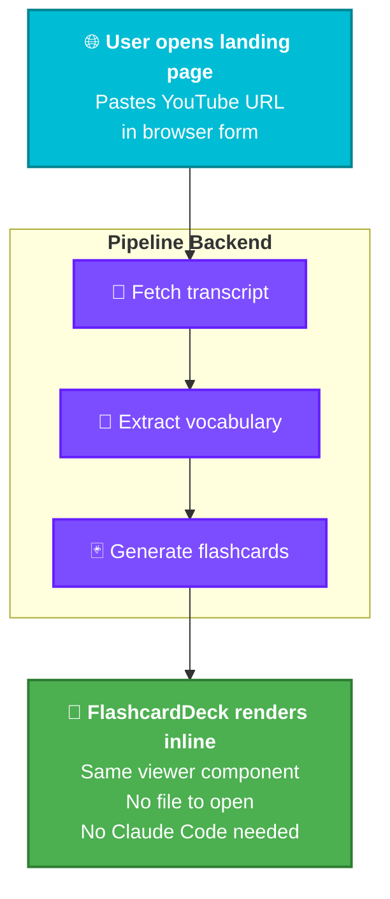

# Project Workflow Diagram

## Phase 1 — Claude Code CLI Pipeline (Current)

The pipeline is invoked inside **Claude Code** via `skills/flashcard-generator/SKILL.md`. The developer provides a YouTube URL as input to Claude, and the full extraction-to-deck workflow runs in one session:

1. **Skill invoked** — The developer calls the `flashcard-generator` skill inside Claude Code with a YouTube URL
2. **URL validation** — Skill validates YouTube URL format
3. **MCP transcript extraction** — `youtube-transcript` MCP downloads Japanese subtitles with millisecond timestamps (falls back to `youtube` MCP on failure)
4. **CJK validation** — Skill checks for hiragana/katakana/kanji characters; surfaces "Japanese subtitles not available" error if none found
5. **Vocabulary subagent** — `vocabulary-extractor` subagent identifies JLPT N5–N3 vocabulary, deduplicates words, reads kanji, filters stopwords, counts occurrences
6. **Flashcard transform** — Skill transforms the VocabularyList into a `FlashcardDeck.json` with sequential card IDs, front/back pairs, YouTube timestamp deep links, and JLPT metadata
7. **JSON output** — `FlashcardDeck.json` written to `output/flashcards-{video_id}.json`
8. **Study** — User opens `ui/index.html` in a browser to flip, filter, sort, and navigate with keyboard

**Phase 1 user flow:**
```
Developer types in Claude Code:
  → invoke flashcard-generator skill with YouTube URL
  → Claude runs pipeline (MCP → subagent → skill → JSON)
  → FlashcardDeck.json written to output/
  → User opens ui/index.html in browser
```

### Phase 1 Pipeline Diagram

```mermaid
flowchart TD
    %% ── THEME ───────────────────────────────
    classDef start  fill:#4caf50,stroke:#2e7d32,color:#fff,stroke-width:2px
    classDef mcp    fill:#cc0000,stroke:#990000,color:#fff,stroke-width:2px
    classDef subag  fill:#7c4dff,stroke:#651fff,color:#fff,stroke-width:2px
    classDef skill  fill:#ff9800,stroke:#e65100,color:#fff,stroke-width:2px
    classDef output fill:#9c27b0,stroke:#6a1b9a,color:#fff,stroke-width:2px
    classDef ui     fill:#00bcd4,stroke:#00838f,color:#fff,stroke-width:2px
    classDef err    fill:#f44336,stroke:#b71c1c,color:#fff,stroke-width:2px
    classDef dec    fill:#ff9800,stroke:#e65100,color:#fff,stroke-width:2px

    %% ══════════════════════════════════════════
    %% ENTRY POINT
    %% ══════════════════════════════════════════
    START["`🎴 **Developer pastes YouTube URL**
    in Claude Code
    → invokes flashcard-generator skill`"]:::start

    %% ══════════════════════════════════════════
    %% L1 — TRANSCRIPT EXTRACTION (MCP)
    %% ══════════════════════════════════════════
    subgraph L1["`**L1 — Transcript Extraction**`"]
        direction TB
        VALID{Valid YouTube URL?}:::dec
        ERR_URL["`❌ Invalid URL
        Not a YouTube link`"]:::err
        MCP1["`📡 **youtube-transcript MCP**
        lang: ja
        include_timestamps: true
        strip_ads: true`"]:::mcp
        MCP_OK{Captions returned?}:::dec
        MCP2["`⚠️ **Fallback: youtube MCP**
        download_youtube_url`"]:::mcp
        CJK{Japanese characters
        in transcript?}:::dec
        ERR_CJK["`❌ Japanese subtitles
        not available`"]:::err
        TRANSCRIPT["`📄 **TranscriptBundle**
        video metadata
        segments with timestamps`"]:::output
    end

    %% ══════════════════════════════════════════
    %% L2 — VOCABULARY EXTRACTION (Subagent)
    %% ══════════════════════════════════════════
    subgraph L2["`**L2 — Vocabulary Extraction**`"]
        direction TB
        SUB["`🧠 **vocabulary-extractor subagent**
        Processes transcript segments
        Identifies Japanese words
        Reads kanji → hiragana
        Filters stopwords / particles
        Counts occurrences
        Output: structured VocabularyList`"]:::subag
        HAS_VOCAB{Found N5–N3
        vocabulary?}:::dec
        ERR_EMPTY["`⚠️ No JLPT N5–N3
        vocabulary found in transcript`"]:::err
        VOCAB["`📚 **VocabularyList**
        word · reading · meaning
        part_of_speech · jlpt_level
        occurrence_count · timestamps`"]:::output
    end

    %% ══════════════════════════════════════════
    %% L3 — FLASHCARD GENERATION (Skill)
    %% ══════════════════════════════════════════
    subgraph L3["`**L3 — Flashcard Generation**`"]
        direction TB
        XFORM["`🃏 **Transform → FlashcardDeck**
        Sequential card IDs
        Front: Japanese word
        Back: reading · meaning · POS · JLPT
        YouTube timestamp deep links
        Secondary timestamp links
        Meta: video info · card count · JLPT breakdown`"]:::skill
        DECK["`💾 **FlashcardDeck.json**
        output/flashcards-{'{'}video_id{'}'}.json`"]:::output
    end

    %% ══════════════════════════════════════════
    %% L4 — STATIC HTML UI
    %% ══════════════════════════════════════════
    subgraph L4["`**L4 — Flashcard Viewer**  _ui/index.html_`"]
        direction TB
        LOAD["`📥 **XHR loads JSON**
        Single card display
        Large CJK font`"]:::ui
        INTERACT["`🔄 **Flip card** — click or Space
        ⬅➡ **Navigate** — arrow keys
        🔗 **YouTube link** — timestamp deep link
        🟢🟠🔴 **JLPT badge** — color-coded`"]:::ui
        FILTER["`🔍 **Filter:** All / N5 / N4 / N3
        📊 **Sort:** Frequency / N5→N3 / N3→N5
        ⚫ **Pagination dots** — JLPT-colored
        📈 **Progress:** X of Y reviewed`"]:::ui
    end

    %% ══════════════════════════════════════════
    %% EDGES — Pipeline flow
    %% ══════════════════════════════════════════
    START --> VALID
    VALID -->|Yes| MCP1
    VALID -->|No| ERR_URL

    MCP1 --> MCP_OK
    MCP_OK -->|Yes| CJK
    MCP_OK -->|No| MCP2
    MCP2 --> CJK

    CJK -->|Yes| TRANSCRIPT
    CJK -->|No| ERR_CJK

    TRANSCRIPT --> SUB
    SUB --> HAS_VOCAB
    HAS_VOCAB -->|Yes| VOCAB
    HAS_VOCAB -->|No| ERR_EMPTY

    VOCAB --> XFORM
    XFORM --> DECK

    DECK --> LOAD
    LOAD --> INTERACT
    INTERACT --> FILTER

    %% ── Contract boundaries ──
    L1 -..- L2
    L2 -..- L3
    L3 -..- L4
```



---

## Phase 2 — Browser URL Input (Planned)

In Phase 2, the URL input moves from the terminal into the browser. The user pastes a YouTube URL directly into a web form, the pipeline runs behind the scenes, and flashcards render inline — no Claude Code interaction needed.

**Phase 2 user flow:**
```
User opens landing page in browser
  → Pastes YouTube URL into web form
  → Pipeline runs (API / server backing)
  → Flashcards render inline in the same page
```

### Phase 2 Planned Diagram



---

## Layer Contracts

Each layer boundary is defined by a formal contract file. Data crossing a boundary must match its contract schema:

| Boundary | Contract File | Input → Output |
|----------|-------------|----------------|
| L1 → L2 | `contracts/transcript-contract.md` | YouTube URL → TranscriptBundle |
| L2 → L3 | `contracts/vocabulary-contract.md` | TranscriptBundle → VocabularyList |
| L3 → L4 | `contracts/flashcard-contract.md` | VocabularyList → FlashcardDeck JSON |

## Key Files

| File | Role |
|------|------|
| `skills/flashcard-generator/SKILL.md` | Entry point — URL validation, MCP invocation, error handling, subagent spawn, JSON output |
| `subagents/vocabulary-extractor/SUBAGENT.md` | Subagent definition — vocabulary extraction, deduplication, stopword filtering |
| `ui/index.html` | Flashcard viewer — loads JSON, renders single card with flip/filter/sort/keyboard nav |
| `ui/app.js` | Viewer logic — flip animation, pagination, JLPT filter, sort, XHR loading, 3D tilt |
| `ui/flashcards.css` | Viewer styles — 3D flip card, JLPT colors, responsive scaling |
| `output/flashcards-{video_id}.json` | Pipeline output artifact — FlashcardDeck consumed by the viewer |
